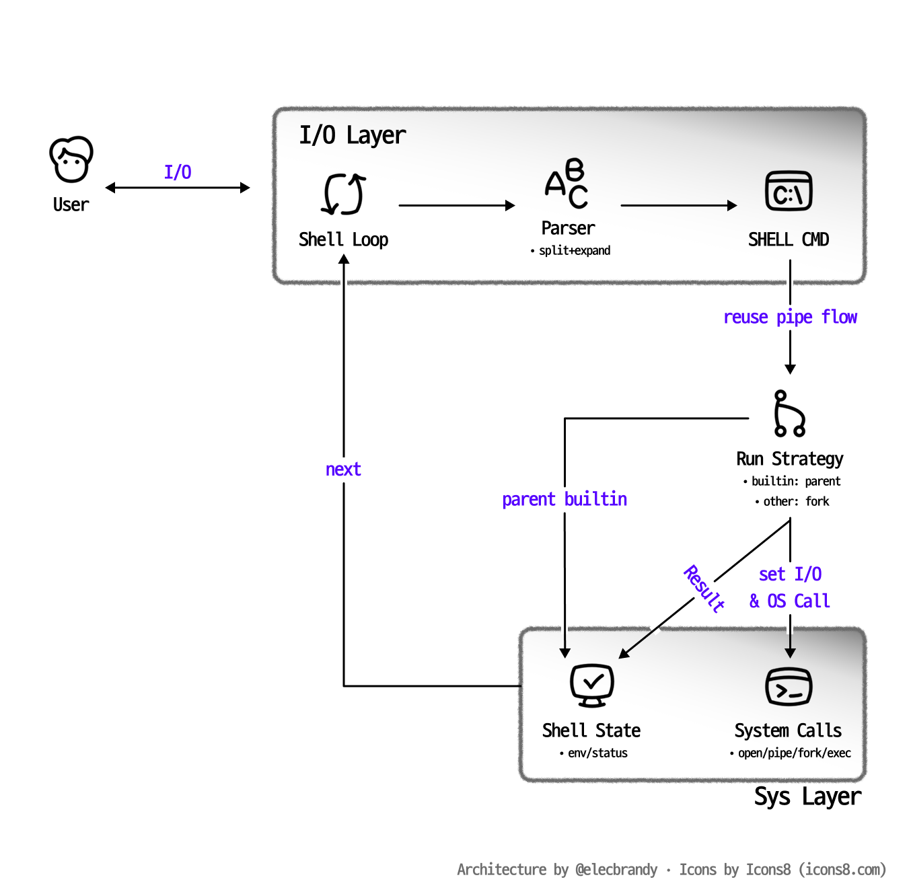

# minishell

 

## 📌 Overview

> _**42 Seoul minishell project**_

- **프로젝트 목표**: Bash와 유사한 간단한 shell 구현
- **핵심 기능**: parsing, redirection, pipe, builtin, process control
- **개발 언어**: `C`

 
 

## 💻 `minishell` 이란?

- **`minishell`** 은 사용자의 명령어를 읽고, 파싱한 뒤, 필요한 프로세스를 생성해 실행하는 작은 shell입니다.
- builtin 명령어는 shell 내부에서 처리하고, 외부 명령어는 `fork`와 `execve`를 통해 실행합니다.
- pipe와 redirection을 command node 기반으로 관리하여 단일 명령어와 파이프라인 명령어를 같은 구조로 처리합니다.

 
 

## 🏗️ System Architecture

 
 

## 📂 Project Structure

| Path | Description |
|---|---|
| `srcs/minishell.c` | shell 진입점, readline loop, 전체 실행 흐름 제어 |
| `srcs/parser` | command line parsing, quote, dollar expansion, redirection, heredoc |
| `srcs/exec` | builtin dispatch, process fork, pipe, wait, execve |
| `srcs/builtin` | `echo`, `cd`, `pwd`, `export`, `unset`, `env`, `exit` |
| `srcs/env` | environment linked list 관리 |
| `srcs/util` | error, signal, free helper |
| `libft` | custom C utility library |
| `includes` | shared structs and function declarations |

 
 

## 🛠️ Tech Stack

| Area | Stack |
|---|---|
| Language | C |
| Build | Makefile |
| Input | GNU Readline |
| Process | fork, execve, wait |
| I/O | pipe, dup2, open, close |
| Data Structure | linked list, string array |

 
 

## ✅ Features

| Feature | Description |
|---|---|
| Prompt | interactive shell prompt |
| Parser | command, argument, quote, environment expansion 처리 |
| Redirection | `<`, `>`, `>>`, `<<` |
| Pipe | command node chain 기반 pipe 처리 |
| Builtin | shell 내부 명령어 실행 |
| External Command | PATH 탐색 후 `execve` 실행 |
| Signal | interactive, child, heredoc signal 처리 |

 
 

## 👥 Team

| 팀원 | 김동은 | 김동우 |
|---|---|---|
| 역할 | `parsing/heredoc`| `cmd, pipe redirection` |

 
 

_*사람이 작성함_
